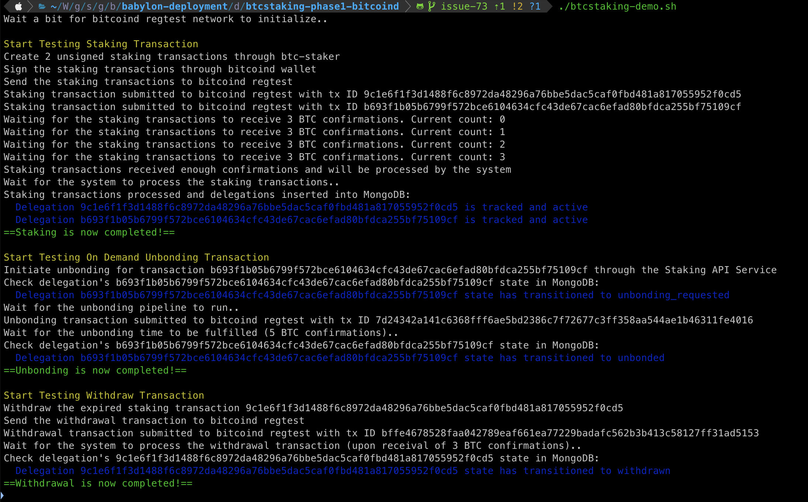
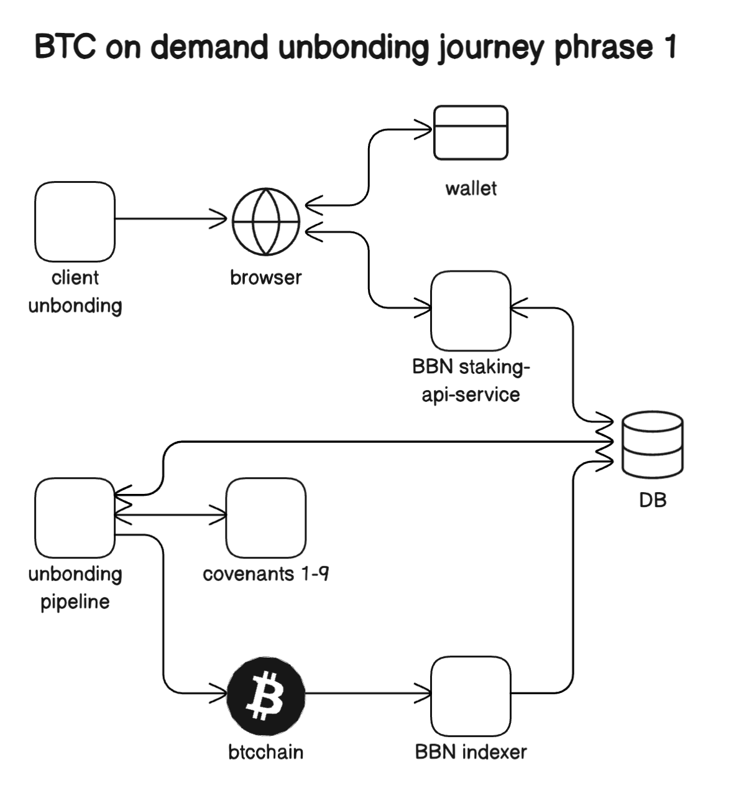

# BTC Staking Phase-1 deployment (BTC backend: bitcoind)

## Components

The system that emulates Babylon's Phase-1 Mainnet network
comprises the following components:

- **BTC Staking Indexer**: Parses BTC blocks and forwards BTC Staking
  transactions to a queueing system, while also persisting them to an on-disk
  key-value storage
- **RabbitMQ**: Houses a set of queues containing BTC Staking transactions
- **Staking API Service**: Consumes BTC Staking transactions from the RabbitMQ
  queues and stores them in a central data store, additionally accepting
  unbonding requests
- **Mongo DB**: Stores BTC Staking transaction data
- **Staking Expiry Checker**: Periodically checks MongoDB for expired BTC
  Stake Delegations and Unbondings
- **Unbonding Pipeline**: Forwards unbonding requests for signing to a Covenant
  Emulator committee and submits them to BTC
- **Staking Dashboard**: UI that allows for creating BTC Staking transactions,
  connects to the API to retrieve information about the system and historical
  delegations
- A Bitcoin node operating an emulated **regtest Bitcoin** network
- A **Global Configuration** file that contains system-wide parameters regarding
  the Staking transactions that are processed by it
- **Covenant Signer**: Receives unbonding transactions and returns the same transactions signed by the covenant emulator's key
- **Bitcoin Offline Wallet**: Stores the Covenant Signer member keys and signs unbonding transactions forwarded by the Covenant Signer
- A **Finality Providers** config file that contains information about finality providers participating in the system 

### Expected Docker state post-deployment

The following containers should be created as a result of the `make` command
that spins up the network:

```shell
[+] ✔ Network artifacts_phase-1         Created                                                       0.1s 
 ✔ Container bitcoindsim             Started                                                       0.6s 
 ✔ Container mongodb                 Started                                                       0.4s 
 ✔ Container rabbitmq                Started                                                       0.5s 
 ✔ Container staking-indexer         Started                                                       1.0s 
 ✔ Container staking-api-service     Started                                                       1.0s 
 ✔ Container unbonding-pipeline      Started                                                       1.3s 
 ✔ Container staking-expiry-checker  Started                                                       1.0s 
 ✔ Container simple-staking          Started                                                       1.7s
 ✔ Container bitcoindsim-signer      Started                                                       1.0s
 ✔ Container covenant-signer         Started                                                       1.0s   
```

## Inspecting the BTC Staking Phase-1 system demo

Deploying the BTC Staking Phase-1 system through the `make start-deployment-btcstaking-phase1-bitcoind-demo` subcommand
leads to the execution of an
additional post-deployment [script](btcstaking-demo.sh) that showcases the
lifecycle of Staking and Unbonding operations inside the Phase-1 system.

We will now analyze each step that is executed as part of the showcasing
script - more specifically, how it is performed and its outcome for the system.

## Sample Output



### Scenario 1: Generate And Send BTC Staking Transaction

We generate a BTC staking transaction and send it to the Bitcoin regtest chain.
Once the transaction receives enough confirmations, it's processed by the
Staking Indexer and placed in the corresponding RabbitMQ queue.

The Staking API Service is listening to this queue; as soon as the transaction
appears, it will be consumed and inserted to the MongoDB, with `active` status.


#### Step by Step Details:

1. Use a custom script to generate the BTC staking transaction

    ```shell
    docker exec unbonding-pipeline /bin/sh -c "cli-tools create-phase1-staking-tx ..."
    ```

2. Fund the staking transactions through the bitcoind wallet
    ```shell
    # `unsigned_staking_tx_hex` is generated as output of step 1
    docker exec bitcoindsim /bin/sh -c "bitcoin-cli -regtest -rpcuser=$BTCUSER -rpcpassword=$BTCPASSWORD -rpcwallet=$BTCWALLET \
        fundrawtransaction $unsigned_staking_tx_hex
    ```

3. Sign the staking transactions through the bitcoind wallet
    ```shell
    docker exec bitcoindsim /bin/sh -c "bitcoin-cli -regtest -rpcuser=$BTCUSER -rpcpassword=$BTCPASSWORD -rpcwallet=$BTCWALLET \
        walletpassphrase $BTCWALLETPASS 600"
    docker exec bitcoindsim /bin/sh -c "bitcoin-cli -regtest -rpcuser=$BTCUSER -rpcpassword=$BTCPASSWORD -rpcwallet=$BTCWALLET \
        signrawtransactionwithwallet $unsigned_staking_tx_hex"
    ```

4. Send the staking transactions to bitcoind regtest
    ```shell
    # `staking_tx_hex` is generated as output of step 3
    docker exec bitcoindsim /bin/sh -c "bitcoin-cli -regtest -rpcuser=$BTCUSER -rpcpassword=$BTCPASSWORD -rpcwallet=$BTCWALLET \
        sendrawtransaction $staking_tx_hex
    ```

5. Check logs in staking-indexer
    ```shell
    docker logs -f staking-indexer
    2024-04-23T14:52:35.163119Z	info	polled block	{"module": "btcscanner", "height": 112}
    2024-04-23T14:52:35.163257Z	info	received confirmed block	{"module": "staking indexer", "height": 112}
    2024-04-23T14:52:35.171101Z	info	found a staking tx	{"module": "staking indexer", "height": 112, "tx_hash": "557deccd8bca87344044be859dbafbbd4decf54d5c1ae8bfda1711975908a76d"}
    2024-04-23T14:52:35.171416Z	info	pushing staking event	{"module": "queue consumer", "tx_hash": "02000000000101ded02b14471eb5368e11595abc23d514dd97ed589e07306acbce7e46da9a46f60100000000feffffff03d5bb973b00000000160014244a6b0a2c8fd9493264bc31ed50286cf9a4e94e400d03000000000022512082f76059ff5a46f59b2e0c0c48e2e503f3e15634aebe6df673266d55d57691b40000000000000000496a47626274340026c1fc943bf425dc1721eb2bfa7110d89049e4f24dfaf20bf34fb0d86bc077ca063deb187a4bf11c114cf825a4726e4c2c35fea5c4c44a20ff08a30a752ec7e001f402473044022040e2c39e27201f5929cfa9dc24ad23397462b20db76c52b5c3662618fc620b22022009f353ae3b72c2542e6933fc2026cebbeac30a49e48dcdba2dbc27de10b4cbeb012102dbf97ad4081332f60f023e8262004736d14ed041ea14681af025c12552c928f000000000"}
    2024-04-23T14:52:35.175238Z	info	successfully pushed staking event	{"module": "queue consumer", "tx_hash": "02000000000101ded02b14471eb5368e11595abc23d514dd97ed589e07306acbce7e46da9a46f60100000000feffffff03d5bb973b00000000160014244a6b0a2c8fd9493264bc31ed50286cf9a4e94e400d03000000000022512082f76059ff5a46f59b2e0c0c48e2e503f3e15634aebe6df673266d55d57691b40000000000000000496a47626274340026c1fc943bf425dc1721eb2bfa7110d89049e4f24dfaf20bf34fb0d86bc077ca063deb187a4bf11c114cf825a4726e4c2c35fea5c4c44a20ff08a30a752ec7e001f402473044022040e2c39e27201f5929cfa9dc24ad23397462b20db76c52b5c3662618fc620b22022009f353ae3b72c2542e6933fc2026cebbeac30a49e48dcdba2dbc27de10b4cbeb012102dbf97ad4081332f60f023e8262004736d14ed041ea14681af025c12552c928f000000000"}
    2024-04-23T14:52:35.175470Z	info	successfully pushing the staking event	{"module": "staking indexer", "tx_hash": "557deccd8bca87344044be859dbafbbd4decf54d5c1ae8bfda1711975908a76d"}
    2024-04-23T14:52:35.186929Z	info	successfully saving the staking tx	{"module": "staking indexer", "tx_hash": "557deccd8bca87344044be859dbafbbd4decf54d5c1ae8bfda1711975908a76d"}
    2024-04-23T14:52:36.165666Z	info	polling confirmed blocks	{"module": "btcscanner", "tip_height": 115}
    ```

6. Check if MongoDB has staking transaction records
    ```shell
    # `staking_txid` is generated as output of step 4
    docker exec mongodb /bin/sh -c "mongosh staking-api-service --eval 'JSON.stringify(db.delegations.find({\"_id\": \"$staking_txid\"}).toArray(), null, 2)'"
    ```

### Scenario 2: Generate and Test On-Demand Unbonding Transaction

We generate a BTC unbonding transaction for a previous staking transaction and
send it to the Staking API Service. The API saves it to a MongoDB collection
containing unbonding requests. 

The unbonding pipeline periodically polls this collection, so subsequently it
retrieves it, signs it using the covenant emulator private keys and sends it 
to the Bitcoin regtest chain.

After the unbonding time in BTC blocks elapses (5 blocks for this
demonstration, retrieved from the global parameters), the Staking Indexer
processes the transaction and send it to the
corresponding RabbitMQ queue. Finally, the Staking API Service retrieves the
event and updates the delegation state to `unbonded`.



#### Step by Step Details:

1. Initiate unbonding for the transaction
    ```shell
    docker exec unbonding-pipeline /bin/sh -c "cli-tools create-phase1-unbonding-request ..."
    ```

2. Submit the payload to the Staking API Service
    ```shell
    # `unbonding_api_payload` is generated as output of step 1
    curl -sSL localhost:80/v1/unbonding -d "$unbonding_api_payload"
    ```

3. Watch the transaction status in MongoDB as `unbonding_requested`
    ```shell
    # `staking_txid` is the hash of the staking transaction that's being unbonded 
    docker exec mongodb /bin/sh -c "mongosh staking-api-service --eval 'JSON.stringify(db.delegations.find({\"_id\": \"$staking_txid\"}).toArray(), null, 2)'" 
    ```

4. Wait for the unbonding pipeline to complete
    ```shell
    docker logs -f unbonding-pipeline
    time=2024-04-23T14:53:15.129Z level=INFO msg="Running unbonding pipeline"
    time=2024-04-23T14:53:15.156Z level=INFO msg="Succesfully sent unbonding transaction" tx_hash=502cdef96cbfe673d3c0dfa3e36f41674e72997c14bb9333f1e6940cbf7005a9
    time=2024-04-23T14:53:15.160Z level=INFO msg="Unbonding pipeline run finished." num_tx_processed=1
    ```

5. Watch the delegation status in MongoDB as `unbonding`
    ```shell
    docker exec mongodb /bin/sh -c "mongosh staking-api-service --eval 'JSON.stringify(db.unbonding_queue.find().toArray(), null, 2)'"
    ```

6. Wait for the unbonding timelock to be fulfilled
    ```shell
    docker logs -f staking-expiry-checker
    {"level":"debug","tx_hash":"219bcb56dac0403a1e851962eaf7436355da35280f53f4b2613426841ea8c5e1","time":"2024-04-23T14:58:02Z","message":"publishing expired staking event"}
    {"level":"debug","tx_hash":"219bcb56dac0403a1e851962eaf7436355da35280f53f4b2613426841ea8c5e1","time":"2024-04-23T14:58:02Z","message":"successfully published expired staking event"}
    ```

7. Watch the delegation status in MongoDB as `unbonded`
    ```shell
    # `staking_txid` is the hash of the staking transaction that's being unbonded 
    docker exec mongodb /bin/sh -c "mongosh staking-api-service --eval 'JSON.stringify(db.delegations.find({\"_id\": \"$staking_txid\"}).toArray(), null, 2)'"
    ```

### Scenario 3: Withdraw Expired Stake

We generate a BTC withdraw transaction for a previous staking transaction for which the timelock has expired and
send it to the Bitcoin regtest chain. Once the transaction receives enough
confirmations, it's processed by the Staking Indexer and placed in the
corresponding RabbitMQ queue.

The Staking API Service retrieves the event and updates the delegation state
to `withdrawn` in MongoDB.


#### Step by Step Details:

1. Initiate withdraw for the transaction
    ```shell
    docker exec unbonding-pipeline /bin/sh -c "cli-tools create-phase1-withdaw-request ..."
    ```

2. Submit to the bitcoind regtest
    ```shell
    # `withdrawal_tx_hex` is generated as output of step 1
    docker exec bitcoindsim /bin/sh -c "bitcoin-cli -regtest -rpcuser=$BTCUSER -rpcpassword=$BTCPASSWORD -rpcwallet=$BTCWALLET sendrawtransaction $withdrawal_tx_hex"
    ```

3. Watch the delegation status in MongoDB as `withdrawn`
    ```shell
    # `staking_txid` is the hash of the staking transaction that's being unbonded 
    docker exec mongodb /bin/sh -c "mongosh staking-api-service --eval 'JSON.stringify(db.delegations.find({\"_id\": \"$staking_txid\"}).toArray(), null, 2)'"
    ```

### Scenario 4: Withdraw Unbonded Staking Transaction

We generate a BTC withdraw transaction for a previously unbonded staking
transaction whose unbonding time has elapsed and
send it to the Bitcoin regtest chain. Once the transaction receives enough
confirmations, it's processed by the Staking Indexer and placed in the
corresponding RabbitMQ queue.

The Staking API Service retrieves the event and updates the delegation state
to `withdrawn` in MongoDB.


#### Step by Step Details:

1. Initiate withdraw for the unbonded transaction
    ```shell
    docker exec unbonding-pipeline /bin/sh -c "cli-tools create-phase1-withdaw-request ..."
    ```

2. Submit to the bitcoind regtest
    ```shell
    # `withdrawal_tx_hex` is generated as output of step 1
    docker exec bitcoindsim /bin/sh -c "bitcoin-cli -regtest -rpcuser=$BTCUSER -rpcpassword=$BTCPASSWORD -rpcwallet=$BTCWALLET sendrawtransaction $withdrawal_tx_hex"
    ```

3. Watch the delegation status in MongoDB as `withdrawn`
    ```shell
    # `staking_txid` is the hash of the unbonded staking transaction that's being withdrawn
    docker exec mongodb /bin/sh -c "mongosh staking-api-service --eval 'JSON.stringify(db.delegations.find({\"_id\": \"$staking_txid\"}).toArray(), null, 2)'"
    ```
